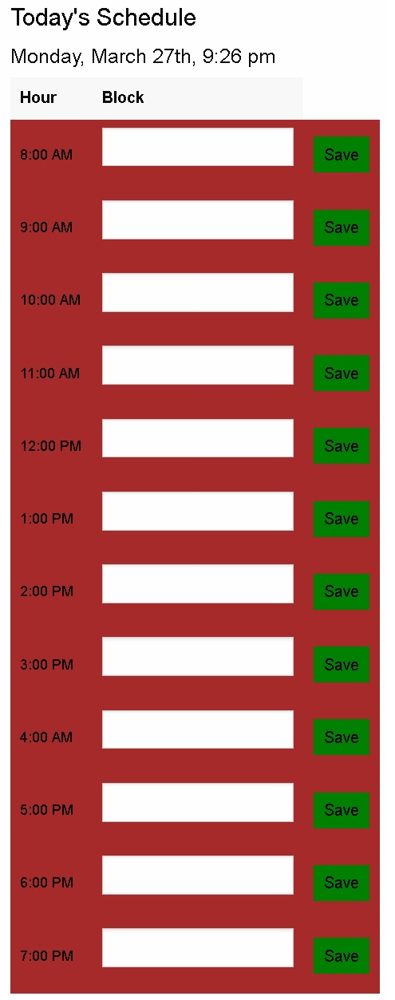

# Work Day Scheduler
For planning out the day~

## Summary
Because everyone is busy, we need a way to keep track of our daily activities. What better way to do so than to make a webpage for that? On our Work Day Scheduler, you can differentiate by color whether a time of the day has passed or not. In addition, you can enter a message into each hour block to remind yourself of your plans.

## Features
>A block of working hours, between 8AM and 7PM to view
>
>Changing color codes: as the day passes, the hour blocks change to reflect the passage of the day: red for hours past, yellow for the present hour, and green for hours yet to be spent.
>
>Form entry slots in each hour block for the purposes of entering a message or explanation of your plans.
>
>A save button which currently saves to local storage, but still needs some work in order to be persistant.

## Screenshots of Finished Webpage
>Taken after 9PM

## Link to active Webpage
